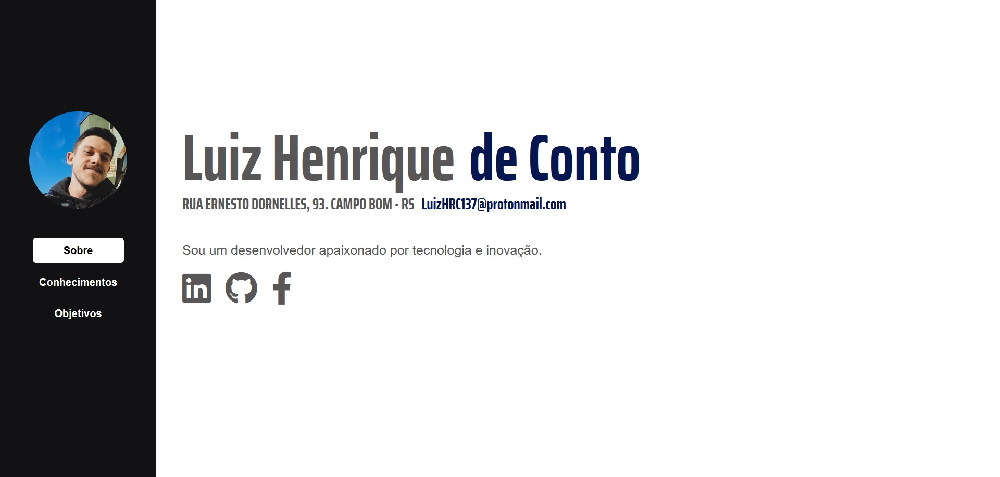

# Currículo Digital - Luiz Henrique

Este projeto é um currículo digital desenvolvido com HTML e CSS. O currículo é dividido em três seções principais, cada uma representada por uma página HTML:

- **Sobre**: Apresenta informações pessoais, endereço, e-mail, descrição e links para redes sociais.
- **Conhecimentos**: Mostra uma lista dos conhecimentos técnicos adquiridos.
- **Objetivos**: Detalha os objetivos profissionais e pessoais.

## Visão Geral

Abaixo está uma captura de tela da página inicial do currículo:

## Arquivos do Projeto

O projeto inclui os seguintes arquivos:

- `index.html`: Página inicial com informações gerais.
- `conhecimentos.html`: Página detalhando os conhecimentos técnicos.
- `objetivos.html`: Página com os objetivos profissionais e pessoais.
- `styles.css`: Folha de estilos que define a aparência das páginas.

## Tecnologias Usadas

- HTML5
- CSS3
